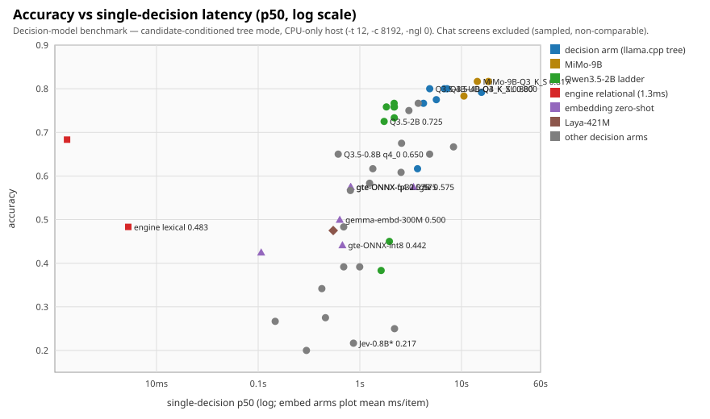
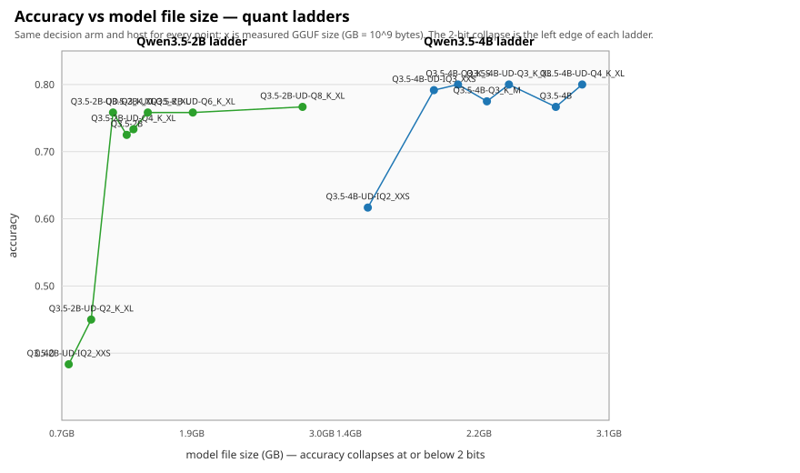
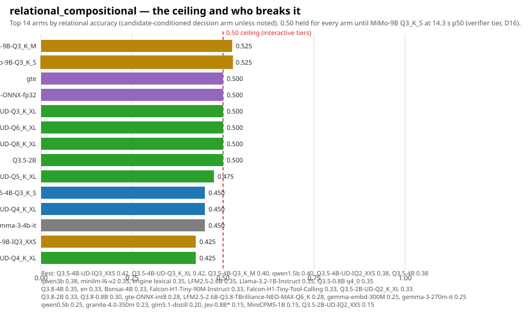
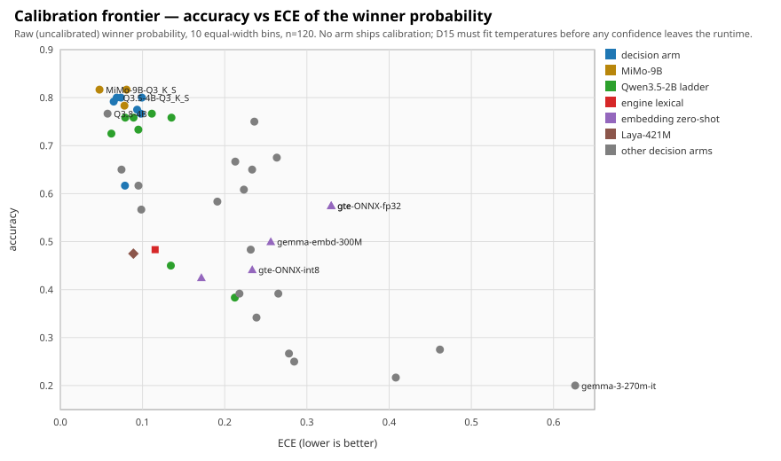

# Decision-model benchmark — full report (Phase 13)

This is the narrative record of the Phase 13 model sweep: what was measured,
how, what it means, and how to reproduce it. The generated board lives in
[`summary.md`](summary.md); every row there is derived from an out-of-tree
run JSON pinned by [`models.manifest.json`](models.manifest.json) (SHA-256
per artifact, D14). The charts in [`charts/`](charts/) are rendered by
[`../runner/plot.py`](../runner/plot.py) directly from those run JSONs —
they are a view of the record, never a source.

**Status: 48 runs (2026-09-25 → 2026-09-28).** Binding tier picks are in
`docs/DECISIONS.md` D16 (amended ×3, extended ×1); this report is the
evidence behind them.

## Executive summary

The escalation ladder works, and the measured ladder has four tiers. The
engine's zero-ML stack — the relational solver (exact proofs over
extracted facts) over the lexical classifier — now decides metadata-class
questions at 0.88 and **breaks the 0.50 relational ceiling outright**
(0.950) at 1.3 ms p50 with no model file anywhere; embeddings own cheap
paraphrase matching; small general LLMs — scored as constrained candidate
distributions, not as chat — own everything interactive up to ~4B; and a
9B MoE (MiMo-V2.6) remains the only *model* arm past the relational
ceiling, at verifier-tier latency.

| tier | pick | acc | ECE | rel | p50 | size |
|---|---|---|---|---|---|---|
| frontier (verifier) | MiMo-V2.6-Distill-Qwen-9B **Q3_K_S** | 0.817 | **0.048** | **0.525** | 14.3 s | 4063 MiB |
| interactive reference | Qwen3.5-4B **Q3_K_S** | 0.800 | 0.069 | 0.45 | 6.8 s | 2009 MiB |
| interactive (fastest 0.800) | Qwen3.5-4B **UD-Q4_K_XL** | 0.800 | 0.074 | 0.45 | 4.9 s | 2778 MiB |
| balanced | Qwen3.5-2B (Q4_K_M) | 0.725 | **0.062** | 0.50 | 1.7 s | 1222 MiB |
| fast | Qwen3.5-0.8B (q4_0) | 0.650 | 0.074 | 0.35 | 613 ms | 537 MiB |
| zero-ML floor (engine default) | relational-v1 over lexical | 0.683 | 0.094 | **0.950** | **1.3 ms** | 0 MiB |

Every decision arm on the board is **bit-deterministic** under a full
double replay (`predictions_match`, `max_prob_delta = 0.0`). Raw winner
probabilities are **uncalibrated everywhere** (ECE 0.048–0.626), which is
why D15 calibration still gates any confidence exposure. The D15 fits
themselves are now measured and committed: fitted temperature artifacts
for the tier arms live in [`calibration/`](calibration/) with the
before/after evidence in [`CALIBRATION.md`](CALIBRATION.md) — all LLM
tiers are overconfident (T 0.84–1.67, frontier ECE 0.048 → 0.026), the
embedding rung's fit is degenerate (ordering-only, no artifact), and the
engine's proof/delegate stack rejects a global temperature too (its
proofs are already certain; no artifact).

## Methodology

### Suite

`suite/suite.json` — 120 byte-locked items (seed 20260926), 40 per class:

- **metadata_match** — attribute checking against candidate metadata;
  the class the engine's lexical/metadata rung already decides.
- **lexical_semantic** — paraphrase-ish routing; the embedding rung's home
  turf.
- **relational_compositional** — the cases the reference literature
  (and this sweep) show small models collapse on.

Each item is a canonical-IR Choice question with exactly one correct
candidate id; accuracy is top-1 candidate id. Rerunning
`suite/generate_suite.py` reproduces the exact bytes.

### Harness

Decision arms run on the llama.cpp `parallel-decision` branch
(thecodacus/llama.cpp, ad129b0) via `POST /v1/decision` in **tree mode**:
the shared instructions+schema prefix is prefilled once and cached, every
candidate id is scored as a token path forked from that prefix, and the
response is the **exact constrained distribution over candidate paths** —
nothing is sampled, so results are reproducible bit-for-bit. Server flags
for every run: `-c 8192 -fa on -t 12 --jinja --parallel 1
--decision-seqs 24 -ngl 0` on loopback port 8391. `--timeout` (runner
flag, added during the sweep) bounds each request at 3600 s after 9B
batched tails exceeded the old fixed limit.

### Arm types

1. **engine** (`run_engine.py`) — OpenCodifier's own binary, builtin
   lexical pipeline, zero ML. The baseline every model must beat to earn
   its latency. Outcomes route (accept/verify/abstain) as part of the
   contract.
2. **embedding zero-shot** (`run_embed.py`) — cosine + softmax over
   candidate embeddings. Latency reported as mean ms/item (no p50 block).
3. **Laya-421M** (`run_laya.py`) — a small purpose-trained decision
   model, same suite.
4. **decision arm** (`run_llama.py`) — the constrained tree above. Each
   run also records an optional **chat baseline** (the same questions
   written as JSON by ordinary token-by-token generation, temperature 0)
   and **bulk per-decision timings** (batched contexts, one forward pass
   per class-union candidate set).
5. **chat-only screens** (`llama_chat_baseline_only`) — forks with no
   `/v1/decision` endpoint (K2-Horizon). Sampled decode, JSON-writing:
   context rows, never comparable to decision rows; excluded from charts.

### Metrics

- **accuracy** — top-1 candidate id, overall and per class.
- **ECE** — expected calibration error of the winner probability,
  10 equal-width bins, n=120, **no calibration applied** (this is a
  measurement of the raw artifact, per §73).
- **p50** — median single-decision latency (isolated contexts). Bulk
  batched numbers are reported separately (easier task: class-union
  candidate sets; throughput only).
- **determinism** — full suite replayed twice;
  `predictions_match` + max probability delta.

### Host and measurement discipline

CPU-only host (16-thread APU, 30 GB RAM, no GPU): `-ngl 0` everywhere.
Absolute latencies are therefore CPU-regime numbers — orderings transfer,
constants do not (see threats). Arms ran sequentially with the host
otherwise idle; CI builds and pushes were held while arms measured,
because a GitForge pipeline compile on this host pollutes latency.
Model weights never enter the repository; each result JSON records its
GGUF's SHA-256, merged into `models.manifest.json`.

## Charts

Generated by `runner/plot.py --results-dir <runs> --models-dir <models>`;
regenerated alongside `summary.md` on every sweep extension.



The money chart: the frontier is Step-shaped — the engine at 1.3 ms now
covers metadata *and* relational structure, embeddings cover sub-second
paraphrase, and the LLM tiers buy accuracy in big discrete jumps
(0.8B → 2B → 4B → 9B). MiMo-9B Q3_K_S is the lone point past 0.80, 25×
the 4B latency. Jev-0.8B sits at the bottom-right of the useful region —
see F11.



Both Qwen3.5 ladders are flat from 3 bits up and fall off a cliff at
2 bits. The 4B ladder's plateau starts at Q3_K_S; the 2B ladder needs
Q3_K_XL.



0.50 held for every interactive model arm; only the two 9B MiMo quants
cross it (0.53), paying 14–18 s per decision. The engine's relational
solver ends the chart: 0.950 at 1.3 ms, by proof rather than likelihood.



Accuracy does not buy calibration: the best-calibrated arms scatter across
the accuracy range, and the tiny models are simultaneously the least
accurate and the worst calibrated (gemma-270m: ECE 0.626).

## Complete results

Decision arms + comparable non-LLM arms (chat screens in the next table;
`(caveat)` explained in F11). Acc columns are meta/lex/rel. Sizes are
on-disk MiB at sweep time.

| arm | size | acc (meta/lex/rel) | acc | ECE | p50 | det |
|---|---|---|---|---|---|---|
| engine default (relational over lexical) | — | 0.88 / 0.23 / 0.95 | 0.683 | 0.094 | **1.3 ms** | yes |
| embed gte-modernbert-base | — | 0.45 / 0.78 / 0.50 | 0.575 | 0.330 | 3374.8 ms* | yes |
| embed gte-modernbert-onnx-fp32 | 596 | 0.45 / 0.78 / 0.50 | 0.575 | 0.330 | 811.4 ms* | yes |
| embed gte-modernbert-onnx-q4-b32 | 226 | 0.47 / 0.75 / 0.50 | 0.575 | 0.330 | 815.7 ms* | yes |
| embed gte-modernbert-onnx-int8 | 149 | 0.28 / 0.78 / 0.28 | 0.442 | 0.233 | 674.1 ms* | yes |
| embed embeddinggemma-300M-Q8_0 | 319 | 0.62 / 0.62 / 0.25 | 0.500 | 0.256 | 634.9 ms* | yes |
| embed minilm-l6-v2 | — | 0.30 / 0.62 / 0.35 | 0.425 | 0.172 | 107.0 ms* | yes |
| Laya-421M | — | 0.30 / 0.80 / 0.33 | 0.475 | 0.089 | 547.6 ms | yes |
| Falcon-H1-Tiny-90M-Instruct | 56 | 0.23 / 0.28 / 0.33 | 0.275 | 0.462 | 459.4 ms | yes |
| Falcon-H1-Tiny-Tool-Calling | 65 | 0.28 / 0.20 / 0.33 | 0.267 | 0.278 | 147.0 ms | yes |
| Jev-Style-0.8B-Decision-v3 Q4_K_M (caveat) | 505 | 0.20 / 0.30 / 0.15 | 0.217 | 0.408 | 866.7 ms | yes |
| Llama-3.2-1B-Instruct | 771 | 0.47 / 0.35 / 0.35 | 0.392 | 0.265 | 996.5 ms | yes |
| Bonsai-4B (ternary, 546 MiB) | 546 | 0.93 / 0.70 / 0.33 | 0.650 | 0.233 | 4.86 s | yes |
| LFM2.5-2.6B Q4_K_M | 1597 | 0.93 / 0.55 / 0.35 | 0.608 | 0.223 | 2.55 s | yes |
| LFM2.5-2.6B-Q3.8-TBrilliance-NEO-MAX-Q6_K (DavidAU merge) | 2413 | 0.95 / 0.78 / 0.28 | 0.667 | 0.213 | 8.35 s | yes |
| MiMo-9B IQ3_XXS | 3948 | 1.00 / 0.93 / 0.42 | 0.783 | 0.078 | 10.6 s | yes |
| MiMo-9B Q3_K_M | 4273 | 1.00 / 0.93 / 0.53 | 0.817 | 0.081 | 18.4 s | yes |
| **MiMo-9B Q3_K_S (frontier)** | 4063 | 1.00 / 0.93 / 0.53 | **0.817** | **0.048** | 14.3 s | yes |
| MiniCPM5-1B | 657 | 0.95 / 0.35 / 0.15 | 0.483 | 0.232 | 693.9 ms | yes |
| Qwen3.5-0.8B q4_0 (fast pick) | 537 | 0.93 / 0.68 / 0.35 | 0.650 | 0.074 | 612.6 ms | yes |
| Qwen3.5-2B UD-IQ2_XXS | 733 | 0.55 / 0.45 / 0.15 | 0.383 | 0.212 | 1.62 s | yes |
| Qwen3.5-2B UD-Q2_K_XL | 922 | 0.62 / 0.40 / 0.33 | 0.450 | 0.134 | 1.95 s | yes |
| Qwen3.5-2B UD-Q3_K_XL | 1106 | 0.95 / 0.82 / 0.50 | 0.758 | 0.135 | 1.83 s | yes |
| Qwen3.5-2B UD-Q4_K_XL | 1278 | 0.97 / 0.80 / 0.42 | 0.733 | 0.095 | 2.18 s | yes |
| Qwen3.5-2B UD-Q5_K_XL | 1399 | 1.00 / 0.80 / 0.47 | 0.758 | 0.089 | 2.19 s | yes |
| Qwen3.5-2B UD-Q6_K_XL | 1779 | 0.97 / 0.80 / 0.50 | 0.758 | 0.079 | 2.17 s | yes |
| Qwen3.5-2B UD-Q8_K_XL | 2704 | 1.00 / 0.80 / 0.50 | 0.767 | 0.111 | 2.18 s | yes |
| **Qwen3.5-2B Q4_K_M (balanced)** | 1222 | 0.95 / 0.72 / 0.50 | 0.725 | **0.062** | 1.73 s | yes |
| Qwen3.5-4B Q3_K_M | 2188 | 1.00 / 0.93 / 0.40 | 0.775 | 0.093 | 5.66 s | yes |
| **Qwen3.5-4B Q3_K_S (reference)** | 2009 | 1.00 / 0.95 / 0.45 | **0.800** | 0.069 | 6.78 s | yes |
| Qwen3.5-4B UD-IQ2_XXS | 1450 | 0.97 / 0.50 / 0.38 | 0.617 | 0.079 | 3.70 s | yes |
| Qwen3.5-4B UD-IQ3_XXS | 1859 | 1.00 / 0.95 / 0.42 | 0.792 | 0.065 | 15.7 s | yes |
| Qwen3.5-4B UD-Q3_K_XL | 2324 | 1.00 / 0.97 / 0.42 | 0.800 | 0.099 | 7.22 s | yes |
| **Qwen3.5-4B UD-Q4_K_XL (fastest 0.800)** | 2778 | 1.00 / 0.95 / 0.45 | **0.800** | 0.074 | **4.87 s** | yes |
| Qwen3.5-4B q4_k_m | 2614 | 1.00 / 0.93 / 0.38 | 0.767 | 0.098 | 4.23 s | yes |
| Qwen3.8-0.8B-Distilled | 1447 | 0.85 / 0.55 / 0.30 | 0.567 | 0.098 | 807.7 ms | yes |
| Qwen3.8-2B-Distill | 1252 | 0.90 / 0.62 / 0.33 | 0.617 | 0.095 | 1.34 s | yes |
| Qwen3.8-4B-Distill | 2655 | 1.00 / 0.95 / 0.35 | 0.767 | 0.057 | 3.76 s | yes |
| gemma-3-270m-it q4_k_m | 242 | 0.23 / 0.12 / 0.25 | 0.200 | 0.626 | 298.5 ms | yes |
| gemma-3-4b-it | 2375 | 0.95 / 0.85 / 0.45 | 0.750 | 0.236 | 3.04 s | yes |
| glm5.1-distill | 698 | 0.40 / 0.15 / 0.20 | 0.250 | 0.285 | 2.19 s | yes |
| granite-4.0-350m q4_k_m | 227 | 0.30 / 0.50 / 0.23 | 0.342 | 0.239 | 422.8 ms | yes |
| qwen2.5-0.5b-instruct | 469 | 0.60 / 0.33 / 0.25 | 0.392 | 0.218 | 694.8 ms | yes |
| qwen2.5-1.5b-instruct | 1066 | 0.90 / 0.45 / 0.40 | 0.583 | 0.191 | 1.25 s | yes |
| qwen2.5-3b-instruct | 2008 | 0.90 / 0.75 / 0.38 | 0.675 | 0.263 | 2.58 s | yes |

\* embedding rows report mean ms/item (`ms_per_item`), not a p50 block.

### Long-context A/B: focused extraction (engine arm, §45)

The committed suite's contexts are short (p50 ≈ 20 words), so focused
extraction never engages on them. `suite/suite_long.json` (derived by
`runner/make_long_suite.py`, deterministic, seed-inherited) pads every
item's context to ~3,681 estimated tokens (p50) with distractor prose
whose vocabulary is disjoint — asserted, not assumed — from the item's
question, context, and candidate descriptions, and that names no
candidate id and matches none of the fact grammar's patterns. Gold
answers and candidates are unchanged. The A/B runs the same engine arm
on the same padded suite twice, differing only in `--focus-budget`:

| arm | context | acc (meta/lex/rel) | acc | ECE | p50 |
|---|---|---|---|---|---|
| engine default, full state | ~3,681 tok | 0.88 / 0.23 / 0.95 | 0.683 | 0.094 | 6.70 ms |
| engine default, `--focus-budget 512` | views ≤ 512 tok | 0.88 / 0.23 / 0.95 | 0.683 | 0.094 | 9.22 ms |

**Answer-identical on all 120 items** — the same choices, the same
per-class accuracy, the same ECE, full determinism on both sides. The
engagement tally explains why, and it is the interesting number:

- **84/120 items extracted.** Engaged views kept a p50 of **93 tokens**
  (min 12, max 511) out of ~3,681-token states of ~145 sentences (p50) —
  the decision reads ~4% of the state.
- **36/120 items declined to the full state.** All are lexical_semantic
  items whose short prose context ("I think I was billed twice for the
  same month.") shares *no* content vocabulary with the question or the
  candidates — extraction is blind there, and blind extraction declines
  rather than gambling. Every one of those 36 items still answered
  correctly-identically to its full-state run.
- **42/84 engaged views escalated** to the full state (the lexical
  rung's softmax confidence sits below the 0.80 policy gate — a real
  model rung would clear it more often). Escalation changed no answers;
  it is the recall backstop doing nothing expensively.
- Extraction costs ~2.5 ms/item p50 at this scale (BM25 over ~145
  sentences) while deciding on ~40× fewer tokens.

What this A/B does **not** claim: it measures benign dilution (vocab
-disjoint filler), not adversarial distractors. A distractor engineered
to out-score the decisive sentence on BM25 could still pull a view away
from the evidence — which is precisely what reverse escalation exists to
catch, and why the extractor stays deterministic and inspectable in the
trace (`focus_engaged/kept/total/tokens/escalated`).

### Chat-only screens (sampled decode — non-comparable)

| fork | acc | p50 |
|---|---|---|
| K2-Horizon-1B Q4_K_M | 0.725 | 1.50 s |
| K2-Horizon-4B Q4_K_M | 0.700 | 4.88 s |
| K2-Horizon-7B Q4_K_M | 0.800 | 9.05 s |

K2-Horizon has no `/v1/decision`; its 7B chat screen matches the 4B
decision arm's accuracy at 1.3× the latency and none of its
determinism/calibration guarantees — the strongest single argument for
constrained scoring over chat.

### Decision vs chat baseline (same file, two readouts)

For arms that carried both: the decision arm beat its own chat baseline
almost everywhere — often decisively (Qwen3.5-4B q4_k_m: 0.767 vs 0.483;
Qwen3.8-4B: 0.767 vs 0.742; Jev-0.8B: 0.217 vs 0.000). Chat won only
within the ±2–3-item noise band (gemma-3-4b 0.775 vs 0.750; qwen0.5b
0.433 vs 0.392). Writing distills degrade hardest when forced to commit
through token paths (Qwen3.8 series chat > decision is the exception that
proves the rule: those tunes were trained *for* JSON-writing).

### Bulk throughput (batched contexts, per-decision ms)

Prefill dominates on CPU; class-union batched contexts decide 5–8×
cheaper than isolated p50 (e.g. Qwen3.5-4B Q3_K_S: 1.47 s lex / 10.4 s
meta / 2.24 s rel vs 6.8 s isolated p50). MiMo's batched metadata row
(31.2 s) is what exceeded the old fixed 600 s timeout and motivated the
`--timeout` runner flag.

## Quant ladders

**Qwen3.5-2B** (7 UD quants + stock Q4_K_M): 2-bit collapse — IQ2_XXS
0.383, Q2_K_XL 0.450; everything ≥3-bit sits 0.725–0.767. Best ECE in the
whole board belongs to stock Q4_K_M (0.062); UD-Q6_K_XL is the
accuracy-lead quant (0.758) and costs 2.17 s.

**Qwen3.5-4B** (7 quants): the cleanest ladder measured — IQ2_XXS 0.617,
then every ≥3-bit quant ≥ 0.775, with three quants tied at 0.800
(Q3_K_S, UD-Q3_K_XL, UD-Q4_K_XL). Sweet spot: Q3_K_S (smallest of the
0.800s, 2009 MiB); fastest: UD-Q4_K_XL at 4.87 s.

**MiMo-9B** (3 quants): Q3_K_S ≥ Q3_K_M > IQ3_XXS on accuracy
(0.817 / 0.817 / 0.783) and ECE (0.048 / 0.081 / 0.078). The **IQ-quant
latency reversal**: at 4B, IQ3_XXS is 2.3× slower than Q3_K_S (15.7 s vs
6.8 s); at 9B it is 1.35× *faster* (10.6 s vs 14.3 s) — i-quant
dequantization cost scales with the k-quant baseline it replaces, and at
9B the smaller kernel wins. Do not assume i-quant slowness transfers
across sizes.

**2-bit cliff**: at 4B, 0.617; at 2B, 0.383–0.450. Nothing at or below
2 bits is shippable for decision quality, whatever its size.

**Ternary / sub-1-bit packing (2026-09-28 extension).** Bonsai-4B — a
546 MiB (~1.1 bpw) ternary-class 4B — scores **0.650**, the best
accuracy-per-byte on the board by a wide margin (matches the 537 MiB
Qwen3.5-0.8B's accuracy; doubles Llama-3.2-1B at 0.71× the size). But its
p50 is **4.86 s** — the same latency class as the full Qwen3.5-4B
UD-Q4_K_XL at 5× the size. Sub-1-bit packing collapses in-memory size and
destroys CPU prefill in equal measure: the ternary tensor format
dequantizes byte-cheap but compute-heavy. Its 8B sibling is unmeasurable
on this host: `Q2_0_g64` loads but its first decision request exceeded
**10 CPU-hours** (aborted by the 3600 s request timeout), and the plain
`Q2_0`/`PQ2_0` files' tensor data is not readable by the ad129b0 build at
all (deterministic load failure on two fresh downloads; the F16 GGUF is
16.4 GB — beyond this host's memory budget). Ternary ladders are a GPU
question, not a CPU one.

**Ternary second pass (2026-09-28): Bonsai-8B + Ternary-Bonsai-2-27B.**
Bonsai-8B (Q1_0, qwen3, 1105 MiB; the repo's `Bonsai-8B.gguf` and
`Bonsai-8B-Q1_0.gguf` are byte-identical — same SHA-256) **loads and
answers, then falls off a prefill cliff with length**: a ~30-token probe
completes in 5.4 s (prefill 5.07 s), ~130 tokens needs **196 s**, ~260
tokens **405 s**, and ~520 tokens exceeds a 420 s timeout — ≈1.5 s of
prefill per token beyond a ~30-token knee, ≈26× Bonsai-4B's per-token
cost at matched length (4B medians: 4.63 s @ 34 tokens; 58–136 ms/token)
on identical flags and hardware. Both files ship the *same* Q1_0+F32
type set (verified from the GGUF headers), so the 4B row proves this
build has a working Q1_0 fast path — the 8B cliff is a scale/kernel
failure in the ad129b0 build, not a missing-format story. The 120-item
suite (contexts ≤189 tokens) projects to ≈9–13 h of pure prefill:
unmeasurable within campaign budget. Ternary-Bonsai-2-27B (PTQ1_0,
5.67 GiB, qwen3, multimodal per its mmproj files) is **unloadable**:
`output.weight` carries ggml type 143, outside the build's `[0, 43)`
range — prism-ml's packed type exists only in their own fork, and the
repo offers no usable fallback (F16 at 51 GB exceeds host RAM; PQ2_0 is
the unreadable Ternary-8B format family). Net: on CPU, ternary-class
viability in this build is 4B-and-below.

**Embedding-rung runtime bake-off (2026-09-28).** The ONNX question —
"does ONNX Runtime buy CPU speed here?" — answered with a controlled
arm set: the *same* gte-modernbert-base encoder, same suite, same math,
same 4 threads, three runtimes. **ONNX fp32 is identical in quality and
4.2× faster than torch: 0.575 / ECE 0.330 / per-class 0.45-0.78-0.50,
all three equal to the torch row to the digit, at 811.4 ms/item vs
3374.8.** Dynamic int8 quantization collapses quality (0.442; metadata
0.45→0.28, relational 0.50→0.28) for only −17% latency (674.1 ms) —
rejected: it trades the rung's whole margin for a size/latency sliver.
An fp16-weights export (294 MiB) is unloadable by onnxruntime 1.x
(torch 2.14's legacy exporter emits a mixed-dtype LayerNormalization
node); the proper fp16 route needs onnxconverter-common massaging and
was not pursued — int8 already covers the size axis at half the bytes.
EmbeddingGemma-300M Q8_0 via llama.cpp (319 MiB, new `llamacpp` backend
in run_embed.py) scores 0.500 / ECE 0.256 / 634.9 ms — below gte on
accuracy, better calibrated, no tier change. Net: **the embedding rung
moves to ONNX fp32** — same numbers as torch, 4.2× the speed — and the
MiniLM arm's 107 ms/item (8 threads) remains the small/fast option of
the rung. Thread-count confound noted in threats (#11).

**Blockwise int4 arm (2026-09-28, the "Q4_0" question).** ORT 1.30's
`MatMulNBits` quantizer (block_size 32, asymmetric, 4-bit — mechanically
GGUF's Q4_0) on the same fp32 graph produces a 226 MB model (2.6× down
from 596 MB) that **scores 0.575 / ECE 0.330 — blended, per-class
(0.47-0.75-0.50), and ECE identical to fp32 to the digit — at
815.7 ms/item, i.e. no speedup at all** (+0.5% vs fp32's 811.4). Two
asymmetric results: (a) unlike dynamic int8 (0.442), blockwise 4-bit
costs *nothing* in quality — per-32-block affine scales survive encoder
weight distributions that per-channel dynamic int8 destroyed, and the
word-embedding Gather is untouched either way (46 fp32 MatMuls in the
attention path stay fp32); (b) the CPU `MatMulNBits` kernel does not
beat fp32 GEMM at this shape (hidden 768, ≤256-token sequences,
batch 1, AVX2 host) — dequant overhead cancels the 4× weight-bandwidth
gain, so the "4-bit is faster" intuition is LLM-decode-shaped, not
encoder-GEMM-shaped. q4f16 (int4 weights, fp16 activations) is not
testable on this host: ORT's 4-bit op has no fp16-compute CPU path —
that format belongs to QNN/CoreML-class EPs. Verdict: **fp32 stays the
rung's runtime; the 226 MB q4-b32 build is a free memory fallback**
(identical quality, 2.6× smaller) if a deployment is RAM-bound, never a
speed play. Finding F21, threat #12 (quantizer op coverage).

## External anchor: JevBench public split (Phase 17)

Every number above this section is internal (our suite, our seeds). The
JevBench public split (231 items; choice 139 / noul 74 / score 18; mean
chance accuracy 0.3176) is the first third-party ground truth with
published rows for comparable Jev-class systems. Methodology of record:
`../JEVBENCH.md` — the authors' own harness runs our arms (their runner,
their scoring, serial no-retry, raw evidence outside both repos), so
scoring drift against every published row is zero by construction.

| arm | n | accuracy | macro | ECE | Brier | p50 | status |
|---|---:|---:|---:|---:|---:|---:|---|
| **engine** (`relational-v1` via `/v1/decide`) | 231 | **0.3766** | 0.4011 | 0.402 | 0.890 | **2.0 ms** | done, det 231/231 |
| jev_native bridge (0.8B verdict-slot) | 231 | — | — | — | — | — | in flight |
| fork_4b (tree mode, D16 config) | 231 | — | — | — | — | — | pending quiet host |

Published anchors for the same split: hosted Jev 86.6 %, llm-qwen3.5-4b
80.5 % / 651 ms, Jev-Style-2B 73.6 %, decider-2b 71.0 %, open-jev-2b
64.5 %, Jev-Style-0.8B 64.1 % (our bridge row), Laya 58.4 %.

**Reading the engine row honestly.** 0.3766 is barely above the 0.3176
chance floor and far below every trained row. The ladder that scores
0.683 blended on our internal suite does not transfer to items authored
to defeat pattern-matching: its rule/metadata/lexical rungs find no
purchase on adversarial third-party prose, and the confidence gate
correctly refuses to guess — 44/231 items (19 %) abstained and scored
incorrect, which is the designed behavior (§73: abstention is a
successful outcome), not a malfunction. When it does answer it is
overconfident (ECE 0.402 — the calibration seam's uncertainty gates are
calibrated on our suite, not on this distribution). What the row
establishes is the other half of the trade: **2.0 ms p50 client-wall**
(≈325× the jev.page 4B server's claimed 651 ms) with byte-exact replay
determinism over all 231 items. The external anchor says the zero-ML
ladder is a fast prior and a router rung, not a general decider — which
is what the architecture claims it is.

Two measurement bugs died on the way to this row (both recorded in
`../JEVBENCH.md`): the v1/v2 "wedges" at item 186 were the engine's
deterministic 3-consecutive-abstain stretch tripping the harness's
infrastructure stop rule (abstain now maps to the 422 refusal bucket —
still incorrect, no longer run-stopping), and the hours-long crawl was
the harness's per-row fsync stalling on a contended ext4 journal; the
same 231 items take ~60 s with the run directory on tmpfs. Runs v1–v3
are quarantined partials; the of-record run is `runs/jevbench/engine-v4`
(out-of-tree), rerun fresh, never patched up.

## Findings

- **F1 — Tier scheme (D16 ×3).** Four measured tiers: MiMo-9B Q3_K_S
  frontier, Qwen3.5-4B interactive reference (+UD-Q4_K_XL when p50
  matters more than size), Qwen3.5-2B balanced, Qwen3.5-0.8B fast.
- **F2 — The 0.50 relational ceiling is real and local.** 40 arms at or
  below 0.50; the only crossings are the two 9B MiMo quants (0.53), at
  14–18 s. Relational questions stay escalation/verifier territory for
  every interactive-tier model. (Scope narrowed by F22: the ceiling
  binds likelihoods, not proofs — the engine's relational solver now
  scores 0.950 at 1.3 ms.)
- **F3 — The ladder is validated per class.** metadata: engine 0.88 @
  5.3 ms (models reach 1.00 at 10³–10⁶× the latency — the rung earns its
  place); lexical: gte 0.78 (embeddings own it); relational: nothing
  interactive clears 0.50 (escalate) — and now nothing needs to at 1.3 ms
  (F22).
- **F4 — gte zero-shot ties the engine blend exactly (0.575) with
  opposite class profiles** (engine meta 0.88/lex 0.23; gte meta 0.45/
  lex 0.78) — they compose, they don't compete. But gte's ECE 0.330 is
  disqualifying for confidence exposure.
- **F5 — Calibration blocker confirmed.** Best raw ECE 0.048
  (MiMo Q3_K_S), worst 0.626 (gemma-270m). No arm ships calibration;
  until D15 fits temperatures, exposed confidence is a lie.
- **F6 — 2-bit cliff.** F6 = F-ladders above: ≤2 bits never shippable
  (0.617 @ 4B, 0.383–0.450 @ 2B); ≥3-bit 4B plateaus ≥0.775.
- **F7 — Small-model graveyard is real.** Every decoder ≤350M
  (Falcon-90M ×2, Granite-350M 0.342, gemma-270m 0.200, glm5.1-distill
  0.250) lands *below the engine layer* — a zero-ML pipeline beats them
  outright. Below ~0.5B, don't bother.
- **F8 — IQ-quant latency reversal at 9B** (IQ3_XXS 10.6 s < Q3_K_S
  14.3 s), inverted vs 4B. Quant-family latency intuition does not
  transfer across model sizes; measure, don't assume.
- **F9 — MoE latency is not dense latency.** MiMo-9B (MoE) runs at ~2×
  a dense 4B, not at dense-9B cost — which is exactly why it can sit in
  a verifier tier at all.
- **F10 — Interface mismatch ≠ model quality (Jev-Style-0.8B).** 0.217 /
  chat 0.000 looks like a dead model; it is a *readout* mismatch. The
  v3 tune is trained on per-option verdict slots (`h·(w_yes − w_no)` at
  each option's `->` position with shipped temperatures); candidate-id
  token paths and JSON chat are both outside its trained interface, so
  the row measures the harness-to-model distance, and zero transfer was
  observed. A native verdict-slot readout arm is future harness work
  (backlog #25).
- **F11 — Chat is the wrong interface for decisions.** Same weights,
  same questions: chat loses or ties everywhere, adds sampling
  nondeterminism, and loses calibration entirely. K2's 7B chat screen
  needs 9.05 s to reach what the 4B decision arm does in 4.9–6.8 s
  deterministically.
- **F12 — Writing distills degrade under path commitment.** The
  Qwen3.8-Distill series (trained for JSON-writing) shows chat ≥ decision
  — the only family where the inverted order holds — while general
  instructs (Qwen3.5, qwen2.5) show the opposite. Match the readout to
  the training objective.
- **F13 — Prefill dominates CPU inference.** Batched per-decision times
  are 5–8× under isolated p50; metadata-class prompts are the expensive
  ones (longest contexts). A prompt-diet A/B (backlog #32) is the
  cheapest latency win available.
- **F14 — Manifest discipline earns its keep.** Two identically-sized
  Qwen3.8-0.8B artifacts from different repos hash differently; the
  manifest (D14) is what makes rows reproducible. Also operational:
  MTP-tower variants need `--no-mtp` handling at load, and 9B batched
  tails need explicit timeouts (now a flag).
- **F15 — Ecosystem context (jev-style).** The closest external analog
  ships a decision-gated PreToolUse hook (state-read-then-decide,
  fail-closed, redacted audit), a fitted per-group temperature artifact
  (ECE 0.033→0.011 after fitting — the exact D15 shape), and
  automation-at-error-budget evaluation (coverage at 1/5/10%). All three
  are reference designs for backlog #40, D15/#34, and #34 respectively.
  Its 0.8B decision tune is the F10 row here.
- **F16 — Ternary packing trades size for CPU prefill, to an extreme.**
  Bonsai-4B: 0.650 from 546 MiB — the board's best accuracy-per-byte —
  at 4B-class latency (4.86 s p50); Ternary-Bonsai-8B: >10 CPU-hours per
  decision request (g64 quant) or unreadable tensors (plain Q2_0) on the
  ad129b0 build. The IQ-reversal lesson (F8) sharpens: exotic quant
  schemes must be latency-measured per size, never assumed — and
  ternary-class weights are an accelerator play (backlog #35).
- **F17 — Merge-stacked MoE variants are latency-toxic.** The DavidAU
  "X12 NEO MAX" LFM2.5 merge (12-expert stacking, 2.53 GB at Q6_K) posts
  the best sub-3B lexical score (0.775) and meta 0.95 — at 8.35 s p50,
  the slowest sub-3B arm on the board by 3.2×, for 0.667. Community
  merges optimize benchmark flavor, not decision-tier latency; the
  ladder has no tier where this trade wins.
- **F18 — Same quant types, opposite latency fate.** Bonsai-8B loads
  (Q1_0+F32 — the same type set as Bonsai-4B, verified from the GGUF
  headers) yet prefills at ≈1.5 s/token beyond a ~30-token knee (196 s @
  130 tok, 405 s @ 260 tok, >420 s @ ~520 tok) — ≈26× Bonsai-4B's
  per-token cost at matched length. A model that answers a trivial
  prompt in 5.4 s can still be unrunnable at real context lengths:
  per-token prefill must be probed at length, never inferred from model
  size or a hello-world latency. (Operational footnote: the two files
  are byte-identical artifacts under two names — only the SHA-256
  manifest distinguishes them.)
- **F19 — Custom ggml types lock GGUFs to their forks.**
  Ternary-Bonsai-2-27B PTQ1_0 fails deterministically at load:
  `output.weight has invalid ggml type 143. should be in [0, 43)` —
  measurable only under prism-ml's own llama.cpp build. A model card
  size ("TQ1_0 @ 5.95 GB") says nothing about whether a given runtime
  can read the tensors; format support is a measured property of the
  (build, artifact) pair, exactly like latency (F8/F16).
- **F20 — ONNX buys CPU speed exactly where the architecture said it
  would: the encoder rung.** Same model, same suite, same math: gte
  ONNX-fp32 = torch to the digit on accuracy/ECE/per-class, 811 ms vs
  3375 ms per item (4.2×). And its limits are equally measured: dynamic
  int8 loses 0.133 accuracy for 17% latency (embedding geometry does
  not survive weight-only quantization here), and an fp16 export fails
  to load outright (exporter defect). Runtimes and quant schemes are
  per-rung empirical questions — the ladder's "cheapest reliable
  mechanism" rule extends to the runtime layer.
- **F21 — Blockwise 4-bit is quality-free and speed-free on the CPU
  encoder rung.** ORT MatMulNBits (block 32, asymmetric — the Q4_0
  analog) on gte: 0.575 / ECE 0.330 identical to fp32 to the digit at
  226 MB (2.6× smaller) and +0.5% latency — memory fallback, not a
  speed play. The int8 collapse (F20) is therefore a *scheme* failure,
  not a "quantization kills encoders" fact: per-32-block affine scales
  preserve what per-channel dynamic int8 destroyed. And the CPU
  MatMulNBits kernel does not beat fp32 GEMM at batch-1 encoder shapes
  — dequant overhead cancels weight-bandwidth savings, so "4-bit is
  faster" is LLM-decode intuition that does not transfer. q4f16 is
  untestable here (no fp16-compute CPU path in ORT's 4-bit op).
- **F22 — The relational ceiling was never a likelihood problem; exact
  proofs break it for free.** PLANNING.md §43's cheapest-reliable-rung
  principle, applied literally: the engine now extracts relational facts
  from state text with an exact grammar ("X depends on Y", "X: healthy,
  degraded, down", "X comes back online only after Y") and proves root
  cause / healthiest group / first-restored over the whole extracted
  structure, answering only when the proof is unique, inside the
  candidate set, and agreed by every operator — else delegating to the
  lexical classifier unchanged. Measured on the byte-locked suite:
  relational_compositional 0.350 → **0.950**, blended 0.483 → **0.683**,
  p50 5.3 ms → **1.3 ms** (proofs are closed-form set work — cheaper
  than BM25 scoring), other classes bit-identical (no regression), and
  the whole arm still bit-deterministic. Every proof leaves at p = 1.0
  and is right (26/26); the two relational misses were delegated items
  at hedge probabilities — the failure mode is honest hedging, not
  false certainty. Consequences: (a) the 0.50 ceiling in F2 is a
  *likelihood-only* ceiling — it binds what candidate-conditioned
  decision models can do, not what the runtime knows; (b) the zero-ML
  floor now beats the fast tier outright (0.683 @ 1.3 ms vs Qwen3.5-0.8B
  0.650 @ 613 ms) — D16 amended; (c) a global temperature cannot
  calibrate a proof/delegate stack (CALIBRATION.md finding 2), so the
  engine keeps identity calibration until per-mode calibration exists.

## Threats to validity

1. **n=120, single suite, single seed.** One item = 0.0083. Differences
   under ±2–3 items (±0.017–0.025) are noise; D16 picks were made
   accordingly. No cross-suite generalization is claimed.
2. **Single CPU host.** All latencies are CPU-regime (`-ngl 0`). GPU/APU
   orderings may differ (the 9B IQ reversal in particular should be
   re-checked under Vulkan — backlog #35).
3. **ECE is coarse.** 10 bins, n=120, winner probability only. Good
   enough to prove miscalibration (F5), not to rank arms within 0.02 of
   each other.
4. **Batched numbers are a different, easier task** (class-union
   candidate sets) — throughput evidence only.
5. **Chat screens and chat baselines are sampled** at temperature 0 —
   reproducible in practice, not in principle; never comparable to
   decision rows.
6. **Community quants carry repackaging risk**, mitigated (not
   eliminated) by per-file SHA-256 in the manifest.
7. **The Jev row measures an interface mismatch** (F10), not the tune's
   quality under its native readout.
8. **One run per arm** (plus the determinism replay); no variance
   estimate across server restarts. The two Qwen3.5-4B server generations
   agreed to the item, which is reassuring but not an experiment.
9. **MiMo Q3_K_M's chat baseline was skipped** (`--skip-chat`) to bound
   overnight wall-clock; its decision row is complete. The 2026-09-28
   extension arms (LFM2.5 ×2, Bonsai-4B) also ran `--skip-chat` — the
   LFM2.5 hybrid decodes at 16–60 tok/s on this CPU and its chat
   baseline alone would have cost ~1 h per arm; decision rows are
   complete for all three.
10. **The Ternary-Bonsai-8B row is absent by measurement**, not omission:
    see F16 for the load/perf mechanisms. Nothing about its accuracy is
    claimed here. The same holds for the 2026-09-28 second-pass probes —
    Bonsai-8B (prefill cliff, F18) and Ternary-Bonsai-2-27B (unloadable,
    F19) — each probed to a bounded budget and stopped there.
11. **Embed-arm thread counts differ** (MiniLM 107 ms/item ran at 8
    threads; the gte/gemma arms at 4 to match the torch reference).
    Cross-arm embed latency comparisons carry that factor; the bake-off
    verdict (F20) only compares arms run at identical thread counts.
12. **MatMulNBits op coverage.** The int4 quantizer rewrites MatMul
    nodes only — 46 attention-path MatMuls stay fp32 and the embedding
    Gather is untouched — so the 226 MB q4 arm is not a whole-graph
    4-bit result, and its numbers say nothing about fully-int4 encoders.

## Reproduction

```bash
RUNS=/nas/Temp/work/oc-model-eval/runs        # out-of-tree measurement dir
MODELS=/nas/Temp/work/oc-model-eval/models    # operator-supplied GGUFs

# decision arm (per model; llama.cpp = thecodacus parallel-decision build)
python3 runner/run_llama.py --llama-dir /path/to/llama.cpp \
    --models-dir "$MODELS" --model <model>.gguf --timeout 3600 \
    --out "$RUNS/llama__<model>.json"

# other arms
python3 runner/run_engine.py --binary target/release/opencodifier \
    --out "$RUNS/engine__builtin-lexical.json"
python3 runner/run_embed.py --model-dir /path/to/minilm --out "$RUNS/embed__minilm.json"
python3 runner/run_laya.py --out "$RUNS/laya__en.json"

# long-context focused-extraction A/B (§45); regenerate the suite first
python3 runner/make_long_suite.py
python3 runner/run_engine.py --binary target/release/opencodifier \
    --suite suite/suite_long.json --out "$RUNS/engine__lexical__long__full.json"
python3 runner/run_engine.py --binary target/release/opencodifier \
    --suite suite/suite_long.json --focus-budget 512 \
    --out "$RUNS/engine__lexical__long__focused.json"

# merge + render (then copy summary.md, models.manifest.json, charts/ in-tree)
python3 runner/summarize.py --results-dir "$RUNS"
python3 runner/plot.py --results-dir "$RUNS" --models-dir "$MODELS"
```

Suite regeneration must be byte-identical:
`python3 suite/generate_suite.py` (seed 20260926). Manifest coverage:
`summarize.py` re-hashes every model file a result references; a changed
hash is a changed artifact and invalidates the row (D14).

## Revision history

- **2026-09-25** — initial typed board (5 arms); Gemma-3-4b provisional
  pick (D16 v1).
- **2026-09-26** — ladder build-out: Qwen3.5-2B pick (D16 amended),
  Qwen3.8-Distill series, chat-baseline arm fixed, 2B UD ladder.
- **2026-09-26/27** — extension sweep: 4B UD ladder, MiMo-9B ×3, tiny
  decoders, gte/Laya arms, K2 chat screens, D16 tier scheme (amended ×2).
- **2026-09-28** — closeout at 41 runs: MiMo Q3_K_M retry, Jev-Style-0.8B
  interface-mismatch row (F10), D16 amended ×3, aegis baseline regen,
  this report + charts added.
- **2026-09-28 (extension)** — 44 runs: LFM2.5-2.6B Q4_K_M (0.608 @
  2.55 s — first hybrid-conv architecture on the board, dominated by
  Qwen3.5-2B at the same latency), Bonsai-4B ternary (0.650 from
  546 MiB — best accuracy-per-byte, 4B-class latency, F16), the DavidAU
  X12 NEO MAX merge (0.667 @ 8.35 s — latency-toxic, F17), and
  Ternary-Bonsai-8B recorded as unmeasurable on this host. No tier
  changes (D16 extended ×1).
- **2026-09-28 (ternary second pass)** — still 44 runs, no tier changes
  (D16 extended ×2): Bonsai-8B Q1_0 measured to a prefill cliff — loads,
  ≈1.5 s/token beyond a ~30-token knee, suite projects to 9–13 h (F18);
  Ternary-Bonsai-2-27B PTQ1_0 recorded as unloadable (ggml type 143,
  F19). On-CPU ternary viability in this build is 4B-and-below.
- **2026-09-28 (embedding-rung bake-off)** — 47 runs: gte ONNX-fp32
  (identical quality to torch at 4.2× the speed — the rung's runtime
  moves to ONNX, F20), gte ONNX-int8 rejected (0.442, quality collapse
  for −17% latency), EmbeddingGemma-300M Q8_0 via llama.cpp recorded
  (0.500 / ECE 0.256 / 634.9 ms; `llamacpp` backend added to
  run_embed.py), fp16 export unloadable and skipped. No tier changes
  (D16 amended ×6).
- **2026-09-28 (blockwise int4 arm)** — 48 runs: gte ONNX q4-b32 (the
  Q4_0-analog MatMulNBits build) scores fp32-identical blended/per-class/
  ECE at 226 MB with no speedup — quality-free and speed-free (F21);
  q4f16 untestable on the CPU host (no fp16-compute path). No tier
  changes (D16 amended ×7); fp32 stays the rung's runtime, q4-b32 is the
  RAM-bound fallback.
- **2026-09-28 (relational solver arm)** — 49 runs: the engine's default
  stack becomes the relational solver over the lexical classifier; the
  re-run engine arm (identity `relational-v1|builtin-lexical-v1`) lifts
  relational_compositional 0.350 → 0.950 and blended 0.483 → 0.683 at
  1.3 ms p50 (F22), breaking the relational ceiling 4 orders of
  magnitude below the first model that crossed it. Fast tier undercut
  (D16 amended ×8); the retired `builtin-lexical-v1` calibration
  artifact was replaced by the no-artifact finding for the bimodal
  proof/delegate stack (CALIBRATION.md).
- **2026-09-28 (focused-extraction A/B)** — +2 engine-suite runs on the
  derived long suite (`suite_long.json`, contexts ~3,681 est. tokens):
  the engine with `--focus-budget 512` is **answer-identical to the full
  -state run on all 120 items** (0.683 blended, ECE 0.094, det both
  sides) while engaged views read a p50 of 93 tokens; 36 items declined
  blind to the full state, 42 of 84 engaged views escalated and changed
  nothing (§45 feature, PLAN Phase 16). Extraction costs ~2.5 ms/item
  p50 at this context scale. No board rows change; no tier changes.
- **2026-09-29 (external anchor, engine arm)** — Phase 17 opens: the
  JevBench public split (231 items, official harness, methodology in
  `../JEVBENCH.md`) measures the engine against published Jev-class rows
  for the first time. Engine arm done: 0.3766 (chance 0.3176) at 2.0 ms
  p50, ECE 0.402, replay-deterministic 231/231, zero synthesized
  probabilities; the trained field rows sit 58–87 %. Bridge (native
  verdict-slot vs the 0.8B published 64.1 %) and the fork_4b arm
  pending.
